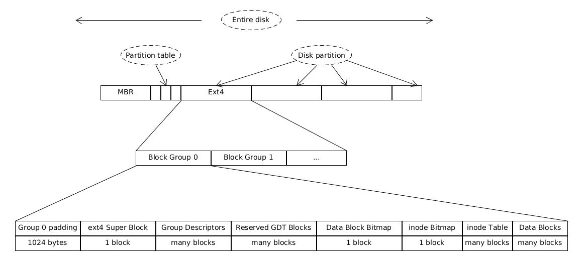
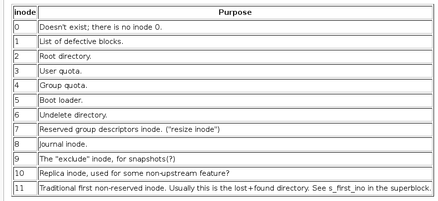
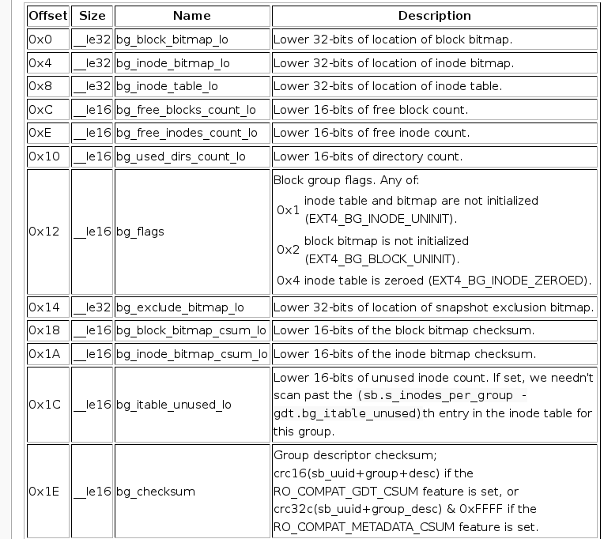
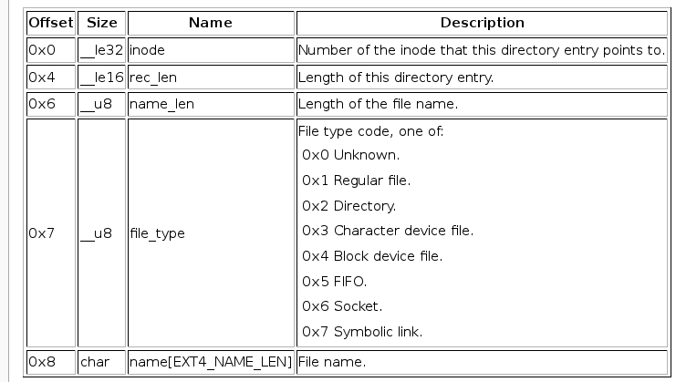

# Ext4 文件系统简要总结

最近在看操作系统的文件系统这块，感觉只有理论还是不行，所以就选了一种文件系统作一下拓展。

选择 Ext4 的原因是： 他是 Linux 的主流文件系统 `ext*` 家族中最新的版本

主要内容：

1. Ext4 的特性
1. Ext4 磁盘布局
- Tips： 本文内容主要是 [Ext4 文档](https://ext4.wiki.kernel.org/index.php/Main_Page) 的概括翻译加上自己的解释说明，所以英文水平还行的话建议直接看英文文档。

本文假设读者对文件系统有基本的了解，否则请先查阅相关资料（《现代操作系统》《操作系统概念(影印版)》）

---

<!-- TOC -->

- [Ext4 文件系统简要总结](#ext4-文件系统简要总结)
    - [主要特性](#主要特性)
        - [兼容性(Compatibility)](#兼容性compatibility)
        - [更大的文件系统和文件大小(Bigger File System and File Sizes )](#更大的文件系统和文件大小bigger-file-system-and-file-sizes-)
        - [拓展子目录数量(Sub directory scalability )](#拓展子目录数量sub-directory-scalability-)
        - [拓展块大小(Extents)](#拓展块大小extents)
        - [多块分配(Multiblock allocation)](#多块分配multiblock-allocation)
        - [延迟分配(Delayed allocation)](#延迟分配delayed-allocation)
        - [快速文件系统检测(Fast fsck)](#快速文件系统检测fast-fsck)
        - [日志校验(Journal checksumming)](#日志校验journal-checksumming)
        - [禁用日志模式("No Journaling" mode )](#禁用日志模式no-journaling-mode-)
        - [在线磁盘整理(Online defragmentation )](#在线磁盘整理online-defragmentation-)
        - [Inode 相关特性(Inode-related features)](#inode-相关特性inode-related-features)
        - [磁盘预分配(Persistent preallocation )](#磁盘预分配persistent-preallocation-)
        - [屏障默认开启(Barriers on by default)](#屏障默认开启barriers-on-by-default)
    - [Ext4 磁盘布局](#ext4-磁盘布局)
        - [概述(Overview)](#概述overview)
            - [块(Blocks)](#块blocks)
            - [布局(layout)](#布局layout)
            - [弹性块组(Flexible Block Groups)](#弹性块组flexible-block-groups)
            - [元块组(Meta Block Groups)](#元块组meta-block-groups)
            - [块组初始化延迟(Lazy Block Group Initialization)](#块组初始化延迟lazy-block-group-initialization)
            - [特殊的节点(Special inodes)](#特殊的节点special-inodes)
            - [块和节点分配策略(Block and Inode Allocation Policy)](#块和节点分配策略block-and-inode-allocation-policy)
            - [校验和(Checksums)](#校验和checksums)
            - [(Bigalloc)](#bigalloc)
            - [(inline Data)](#inline-data)
        - [超级块(The Super Block)](#超级块the-super-block)
        - [块组描述符(Block Group Descriptors)](#块组描述符block-group-descriptors)
        - [块和节点位图(Block and inode Bitmaps)](#块和节点位图block-and-inode-bitmaps)
        - [节点表(Inode Table)](#节点表inode-table)
            - [节点大小（Inode Size）](#节点大小inode-size)
            - [查找节点（Finding an Inode）](#查找节点finding-an-inode)
            - [节点时间戳（Inode Timestamps）](#节点时间戳inode-timestamps)
        - [`inode.i_block` 内容（The Contents of inode.i_block）](#inodei_block-内容the-contents-of-inodei_block)
            - [符号连接（Symbolic Links）](#符号连接symbolic-links)
            - [直接/间接块寻址（Direct/Indirect Block Addressing）](#直接间接块寻址directindirect-block-addressing)
            - [Extent Tree](#extent-tree)
            - [内联数据（Inline Data）](#内联数据inline-data)
        - [目录实体（Directory Entries）](#目录实体directory-entries)
            - [线性目录（Linear (Classic) Directories）](#线性目录linear-classic-directories)
            - [hash tree 目录](#hash-tree-目录)
    - [参考](#参考)

<!-- /TOC -->

---

## 主要特性

### 兼容性(Compatibility)

Ext4 兼容 Ext3，升级只需运行一些命令即可，不需要变动磁盘格式，升级中不会影响已有的数据。

### 更大的文件系统和文件大小(Bigger File System and File Sizes )

|File System| Max FS Size | Max File Size|block addressing bits|
|:---:|:---:|:---:|:---:|
|Ext3|16TB|2TB|32|
|Ext4|1EB|16TB|48|

Tips:
- 1 EB = 1024 *  1024 TB
- block size： 4 bytes

### 拓展子目录数量(Sub directory scalability )

在一个目录中，

- Ext3 支持 32000 个子目录
- Ext4 支持 64000 个子目录

### 拓展块大小(Extents)

Ext3 为每个文件维护一个 block 表，用于保存这个文件在磁盘上的块号，因为一个 block 只有 4kb 的大小，所以对于一个大文件来说的话，需要维护的 block 表占用的空间就比较可观了，删除和截断等操作的效率也就比较低。

Ext4 使用 extents 代替 block。
extents 由多个连续的 block 组成。能够有效的减少需要维护的 block 表的长度，进而提高在文件上操作的效率

### 多块分配(Multiblock allocation)

当需要将新数据写入磁盘上时，需要块分配器决定将数据写入哪一个空闲块中。

但是 Ext3 写入的时候，每次只分配一个 block(4kb), 也就是说如果要写入 100 Mb 的数据时会调用块分配器 25600 词，效率很低，分配器也无法作优化。

Ext4 使用多块分配器，根据需要，一次调用分配多个块(一个 extents)

### 延迟分配(Delayed allocation)

传统的文件系统尽可能早的分配磁盘 blocks，当进程调用 `write()` 时，文件系统立即为其分配 block，即使数据并没有立即写入磁盘(在缓存中临时存放)。这种方式的缺点是当进程持续向文件写入数据，文件增长时需要分配另外的 block 来存放新增的数据，块分配器无法对分配方式作优化。

而延迟分配策略解决了这个问题，当进程调用 `write()` 时它并不立即分配 blocks，直到数据从缓存写入磁盘时进行分配。写入磁盘时，数据基本就不再增长了，此时使用多块分配器为该文件分配多个 extents

### 快速文件系统检测(Fast fsck)

文件系统检测是一项非常慢的操作，特别是检查文件系统中所有的 inode 节点。

Ext4 跳过未使用的 inode 节点来加快检测速度，根据已使用的 inode 节点的数量不同，性能会提升 2 到 20 倍。

### 日志校验(Journal checksumming)

使用校验和来判断一个日志块是否已失效。

Ext3 使用两阶段(执行 + commit/rollback)提交来保证正确性。

Ext4 使用一阶段提交 + 日志校验来保证正确性，性能提升大约 20%。

### 禁用日志模式("No Journaling" mode )

日志确保了磁盘上内容变动时文件系统的完整性，但是却带来了少量的额外开销(日志记录)。

通过禁用日志特性可以获得少量的性能提升

### 在线磁盘整理(Online defragmentation )

这个特性正在开发中，会包含到之后的版本中。

通过使用延迟分配、extents 和 多块分配能够有效减少磁盘碎片，但是文件内容变动(可以需要另外的 block 来存放数据，这个 block 可能会离原来的地方比较远，从而引发一次额外的寻道)也会带来很多碎片，磁盘碎片整理可以将文件尽可能的重分配到连续的 block 中，从而减少磁盘碎片，提高访问效率。

### Inode 相关特性(Inode-related features)

1. 更大的 inodes：Ext3 支持配置 inode 大小，默认为 128 bytes，Ext4 默认为 256 bytes。增加了一些额外的域(比如纳秒级的 timestamps 或 inode 版本)，剩余的空间用来保存拓展属性。这种方式可以使访问这些属性的速度更快，从而提高应用程序的性能。
1. 当创建目录时，直接为其创建几个保留的 inode 节点，当在这个目录中创建新文件时，就可以直接使用这些保留的 inode 节点，从而提高文件创建和删除的效率。
1. Ext3 的时间属性是秒级的，Ext4 的时间属性是纳秒级的。

### 磁盘预分配(Persistent preallocation )

这个特性允许应用程序预先分配磁盘空间，应用通知文件系统预先分配空间，文件系统预先分配需要的块和数据结构，直到应用程序向该空间写数据前，该空间中是没有数据的。

### 屏障默认开启(Barriers on by default)

这个选项改善了文件系统的完整性，但损失了一些性能。

文件系统在写入数据之前必须先将事务信息记录到日志，然后根据顺序写入，但是这种方式效率比较低。现代的驱动有很大的内部缓存并且为了得到更好的性能会进行操作重排序，所以在写入数据之前，文件系统必须先显式的指示磁盘加载所有的日志。

内核的 阻塞 I/O 子系统使用屏障来实现，即在加载日志时进行阻塞，其他数据 I/O 操作就无法再进行了。

## Ext4 磁盘布局

### 概述(Overview)

- MBR 为主引导记录用来引导计算机。在计算机启动时，BIOS 读入并执行 MBR，MBR 作的第一件事就是确定活动分区(这对应于双系统的计算机开机时选择启动项，单系统的直接就能确定了所以就不需要选择)，读入活动分区的引导块(Boot block)，引导块再加载该分区中的操作系统。
- 分区表(Partition table)用来记录每个分区的起始和结束地址，表中的一个分区为活动分区。
- 每个分区可以装载不同的文件系统, 下面介绍都以 Ext4 为例。
    - Ex4 文件系统将磁盘分为一系列块组(block groups)。为了减少磁盘碎片带来的性能问题，减少寻道时间，块分配器总是尝试将每个文件的所有块分配到同一个块组中。块组的大小由超级块中的属性来定义，通常是 `8 * block_size_in_bytes` 对于块大小为 4Kb 的磁盘来说，每一个组可以包含 32768 个 block，总共 128Mb。块组的数目为磁盘空间除以块组大小
    - 每个块组的磁盘布局都基本相同，下面就块组 0 做简单介绍
        - 1024 bytes 的 Group 0 Padding（boot block）只有 块组0 有，用于装载该分区的操作系统。
        - 超级块(super block)包含文件系统的所有关键参数。
        - Group Descriptors。用于记录块组内部相关的信息。
        - Reserved GDT Blocks。用于文件系统未来的拓展
        - Data Block Bitmap。用于记录块组内部数据块的使用情况。
        - inode Bitmap。用于记录 inode table 中的 inode 的使用情况。
        - inode table
        - Data Block

在 Ext4 中除日志以外的数据都是以小端法存储的。

#### 块(Blocks)

一个块由偶数个扇区(sector)组成，一个块组又由多个块组成。块大小在 build file system 时被指定，通常是 4Kb。如果块大小大于内存页的大小，装载文件系统时可能会遇到问题。

#### 布局(layout)

为了允许安装启动扇区和其他用途，块组 0 的开头 1024 bytes 未被使用。超级块从 第 1024 bytes 开始，通常在第 0 块，但如果块大小是 1Kb，则从第 1 块开始。

Ext4 驱动主要使用在第 0 块组的超级块和组描述符(Group Descriptors)来工作。为了防止磁盘开头部分崩溃而无法访问文件系统，会将超级块和组描述符的副本保存在多个块组中，没有保存副本的块组以数据块位图 (Data Block Bitmap) 开头。

inode table 的位置保存在 `grp.bg_inode_table_*` 中，这是足够容纳 `sb.s_inodes_per_group * sb.s_inode_size` bytes 的连续块。

#### 弹性块组(Flexible Block Groups)

从 Ext4 开始，有了一个叫弹性块组(flex_bg)的新特性。在一个弹性块组中几个普通块组连在一起组成一个逻辑块组，几个普通块组的元数据(inode 节点表和位图等等)都存放在一起，然后弹性块组中剩余的空间都用来存放数据。这种方法可以加快加载速度并且可以使大文件连续存放。组成弹性块组的普通块组的数量为 `2 ^ sb.s_log_groups_per_flex`

#### 元块组(Meta Block Groups)

当没有 `META_BG` 选项时，为了安全考虑，所有的块组描述符都有一份副本存放在第一个块组中，块组默认大小是 128MB(2^27 bytes)，块组描述符是 64 bytes, 所以 ext4 最多能有 2^27 / 64 = 2^21 个块组，这限制了文件系统的大小为 2^21 * 128MB = 256TB。

为了解决这个问题，引入了元块组(`META_BG`)的特性。一个 block 4kb ，可以容纳 64 个块组的描述符，ext4 文件系统以 64 个块组为单位组成一个个元块组，元块组的 64 个块组描述符都放在该元块组的第一个块组中，块组描述符的备份可以放在第二个块组和最后一个块组中。这样就将块组描述符从第一个块组移动到了整个文件系统。文件系统支持的大小从 256TB 增加到了 512PB(2^32 Block groups)。

#### 块组初始化延迟(Lazy Block Group Initialization)

Ext4 提供了 3 个块组描述符标识来启用该特性。

`INODE_UNINIT` 和 `BLOCK_UNINIT` 标识

// TODO

#### 特殊的节点(Special inodes)

#### 块和节点分配策略(Block and Inode Allocation Policy)

#### 校验和(Checksums)

#### (Bigalloc)

#### (inline Data)

### 超级块(The Super Block)

超级块记录了文件系统的关键参数。

`sparse_super` 特性标志被设置后，冗余的超级块和组描述符的副本只保留在组号为 0 或组号为 3，5，7 的倍数的块组中，否则冗余副本会保存在所有的块组中。

超级块占用 1Kb 空间。

详细的参数描述请查阅官方文档，不再赘述。

### 块组描述符(Block Group Descriptors)

在一个块组中，拥有固定位置的数据结构只有超级块和块组描述符。

`flex_bg` 和 `meta_bg` 并不是互斥关系。

ext4 64-bits 特性未开启时占用 32 bytes，开启时占用 64 bytes。

### 块和节点位图(Block and inode Bitmaps)

位图用来记录数据块和 inode 节点的使用情况。

位图中 1 bit 表示一个数据块或 inode 表中的一个节点的使用情况

### 节点表(Inode Table)

在常规的 UNIX 文件系统中， 节点存储文件所有的元数据（时间戳、块映射、拓展属性等等），目录使用另外的数据结构存储。为了找到一个文件的信息，首先要找到文件所在的目录，然后加载该文件的 inode 节点。

为了性能方面的考虑，ext4 存储一部分文件属性到目录实体。

节点表是 inode 节点的线性数组。节点表被分配足够的空间来存放至少 `sb.s_inode_size * sb.s_inodes_per_group` bytes 的节点信息。一个节点所在的块组号可以用 `(inode_number - 1) / sb.s_inodes_per_group` 来计算，在节点表中的偏移量为 `(inode_number - 1) % sb.s_inodes_per_group`

节点属性较多，请查阅文档。

#### 节点大小（Inode Size）

节点大小由超级块中的 `s_inode_size` 决定，默认为 256 bytes。

#### 查找节点（Finding an Inode）

block group = `(inode_number - 1) / sb.s_inodes_per_group`

inode table index = `(inode_number - 1) % sb.s_inodes_per_group`

byte address in the inode table = (inode table index) * `sb->s_inode_size`

#### 节点时间戳（Inode Timestamps）

inode 节点中记录了四个时间戳，分别是 inode 修改时间(inode change time - ctime)，访问时间(access time - atime)，数据修改时间(data modification time - mtime)，删除时间(deletion time - dtime)。这四个域都是 32 位有符号数，代表了从 Unix 纪元(1970-01-01 00:00:00 GMT)所经过的秒数。会在 2038 年溢出。

如果 inode 节点大于 128 bytes 并且多出的部分足够的话，会将 ctime、atime、mtime 拓宽到 64 位。在拓展的 32 位中，低 2 bit 会与原有的 32 位组合，用来表示秒数，高 30 bits用来提供纳秒级的精度。溢出时间从 2038 年延迟到了 2446 年

### `inode.i_block` 内容（The Contents of inode.i_block）

在 inode 节点中 i_block[EXT4_N_BLOCKS=15] 域 一共 60 bytes,通常情况下用来记录文件块的索引信息。

#### 符号连接（Symbolic Links）

// TODO

#### 直接/间接块寻址（Direct/Indirect Block Addressing）

见上图

#### Extent Tree

// TODO

#### 内联数据（Inline Data）

// TODO

### 目录实体（Directory Entries）

在 ext4 文件系统中，目录中保存这文件名到 inode 号的映射。我们可以通过硬连接使不同的文件引用相同的 inode 号。读取一个文件的数据块前，会将其对应的目录的信息先加载到内存。目录和普通文件他们都是用 inode 节点来表示，但不同的是普通文件的 `i_block` 所指向的该文件对应的数据块，目录节点的 `i_block` 所指向的是保存该目录中条目信息的块。

#### 线性目录（Linear (Classic) Directories）

默认情况下，每一个目录将所包含的条目保存到几乎线性的数组中。因为目录条目不能跨越文件系统块，所以在每一块的最后可能都会有剩余的字节，所以它并不是一个严格的数组。准确的来说，一个目录是一系列的数据块，每一个数据块包含了一个保存目录条目的线性数组。

每个目录条目包含一个 32-bits 的 inode 节点号，一个 16-bits 的目录条目长度，一个 16-bits 的文件名长度，一个 `EXT4_NAME_LEN` 长度文件名 `char` 数组。

因为文件名不能超过 255 bytes， 所以新的目录条目将 16-bits 的文件名长度缩减为 8-bits， 剩余的 8-bits 用来保存目录条目对应文件的文件类型。

若超级块中的 `filetype` 标志为 0，使用第一个结构，若为 1，使用第二个结构。

线性的结构会带来查找的效率问题，通常查找文件的操作会频繁执行，每次都用线性时间作这件事效率会比较低

#### hash tree 目录

## 参考

1. [File system](https://en.wikipedia.org/wiki/File_system#Linux)
1. [Ext4 Howto](https://ext4.wiki.kernel.org/index.php/Ext4_Howto)
1. [Ext4 Disk Layout](https://ext4.wiki.kernel.org/index.php/Ext4_Disk_Layout#Overview)
1. [Inode Structure in EXT4 filesystem](https://selvamvasu.wordpress.com/2014/08/01/inode-vs-ext4/)
1. [理解inode](http://www.ruanyifeng.com/blog/2011/12/inode.html)
1. [Linux/Unix 系统编程手册]()
